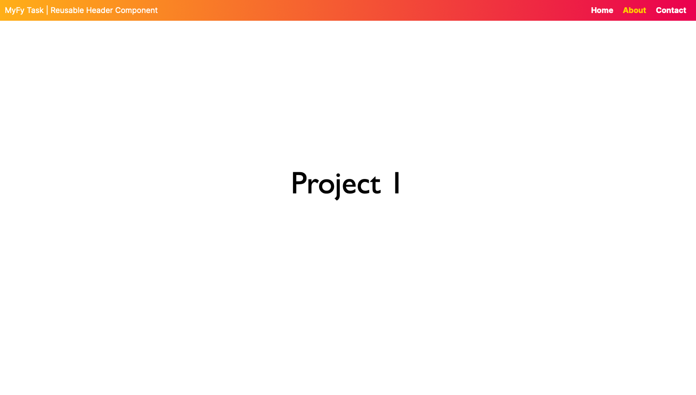
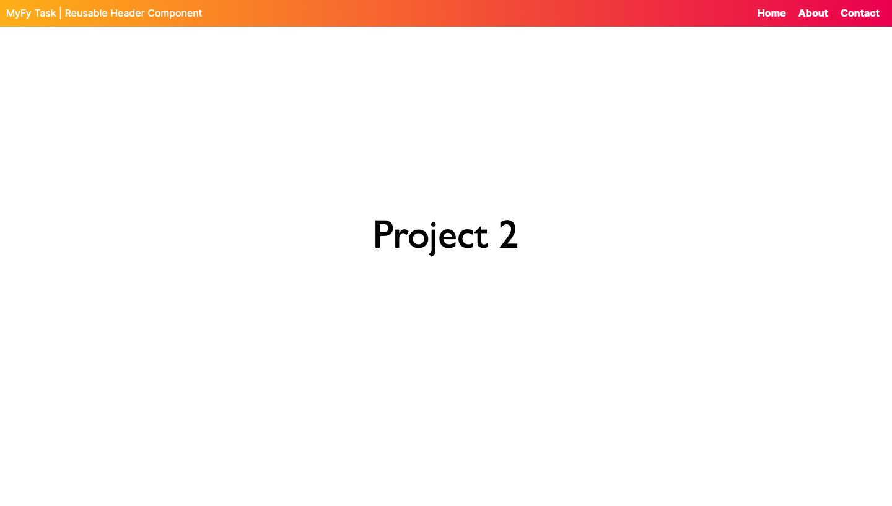

# Custom Header Component for Next.js

This repository contains a reusable header component for Next.js projects. The header includes a title and navigation links that also glow gold when you hover over them,
and it can be easily integrated and resused within any Next.js projects.

## Installation

To use this header component in your Next.js project, you can install the package from github by writing:

```bash 

npm install git+https://github.com/Arya-P05/header.git

```

Than you import the CSS file and the Header component at the top of the page where you want to use the header:

```js 

import Header from "my-next-header";
import 'my-next-header/Header.css';

```

Next you place the <Header /> component inside the <main> tag or wherever you want the header to appear in your page. For example:

```js
export default function Home() {
  return (
    <main>
      <Header/>
      <h1 className="title">Project 1</h1>
    </main>
  );
}

export default YourPage;
```

Below you see two projects I quickly made in Next.js 14 that use my header component:




Although it looks like i only changed the number, I did infact make the two seperate projects to insure I can intall this component as a github package and instantly use it within my applications. :)


